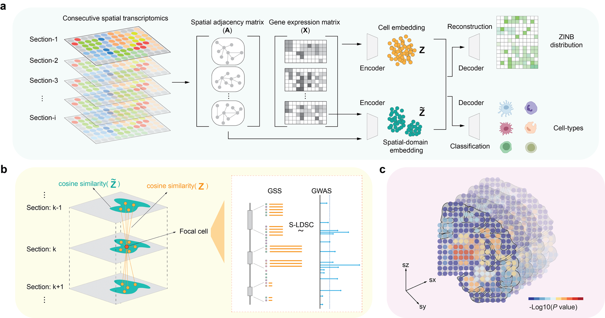

# gsMap3D

**gsMap3D** integrates 3D spatial transcriptomics (ST) data with genome-wide association study (GWAS) summary statistics to map cells associated with human complex traits and diseases.

---

## ✨ What's New

    - Support for 3D ST data mapping  
    - Dual-embedding strategy for more accurate gene specificity scoring  
    - Full GPU acceleration across all analysis steps
---

## 🚀 Features

- **Spatially-aware High-Resolution Trait Mapping**  
  Maps trait-associated cells at single-cell resolution, offering insights into their spatial distributions.

- **Spatial Region Identification**  
  Aggregates trait–cell association p-values into trait–tissue region association p-values, prioritizing tissue regions relevant to traits of interest.

- **Putative Causal Genes Identification**  
  Prioritizes putative causal genes by associating gene expression levels with cell–trait relevance.

- **Scalability**  
  Employs [JAX](https://github.com/google/jax) JIT and GPU/TPU acceleration to scale to million-scale cells (spots) spatial omics datasets.

---

## 🧠 Overview of `gsMap3D`

`gsMap3D` operates on a four-step process:

#### 1. Gene Specificity Assessment in 3D Spatial Contexts
To address technical noise and capture spatial correlations of gene expression across consecutive ST sections,  
`gsMap3D` constructs batch-corrected dual embeddings of molecular and spatial features. These embeddings jointly model transcriptomic similarity and local spatial context to identify homogeneous cells in 3D space. Gene specificity scores (GSS) are then computed by aggregating normalized gene expression ranks across these 3D homogeneous cells, enabling robust identification of genes that are both highly and specifically expressed in focal cells.

#### 2. Linking Gene Specificity to Genetic Variants
`gsMap3D` links gene specificity scores to single nucleotide polymorphisms (SNPs) by assigning GSS to SNPs based on their proximity to gene transcription start sites (TSS) and SNP-to-gene epigenetic linking maps, thereby connecting spatially resolved gene expression patterns with trait-associated genetic variation.

#### 3. 3D Spatial S-LDSC for Cell–Trait Association
To quantify cell–trait associations in 3D space, `gsMap3D` integrates the 3D gene specificity scores with GWAS summary statistics using stratified LD score regression (S-LDSC). This framework enables the estimation of trait relevance for individual cells by associating their stratified LD scores with GWAS signals.

#### 4. Spatial Region–Trait Association Analysis
To evaluate associations between traits and spatial regions, `gsMap3D` aggregates p-values from cells within a given 3D spatial region using the Cauchy combination test, yielding region-level association statistics that reflect coordinated genetic effects across spatially organized cell populations.

---

## 📚 Documentation
Please see our [Documentation](https://yanglab.westlake.edu.cn/gsmap3d/docs) and [Website](https://yanglab.westlake.edu.cn/gsmap3d).

---

## 📝 How to Cite

If you use `gsMap` in your studies, please cite:

- **gsMap3D**: *to be updated.*

- **gsMap**:  
  Song, L., Chen, W., Hou, J., Guo, M. & Yang, J.  
  *Spatially resolved mapping of cells associated with human complex traits.*  
  **Nature** (2025).  
  [https://doi.org/10.1038/s41586-025-08757-x](https://doi.org/10.1038/s41586-025-08757-x)

---